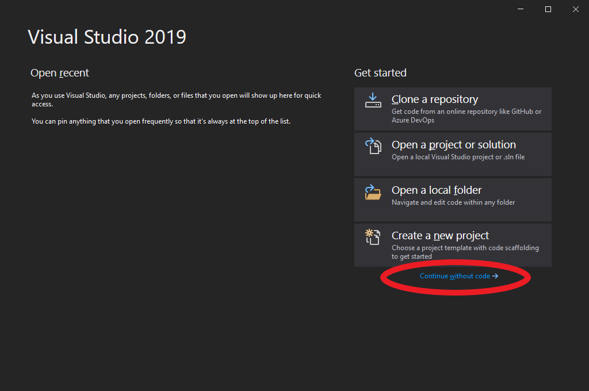
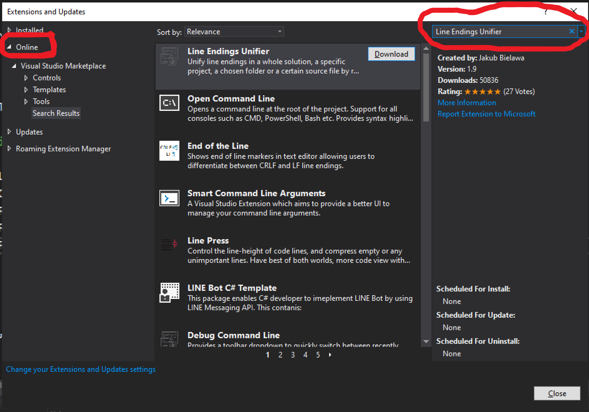
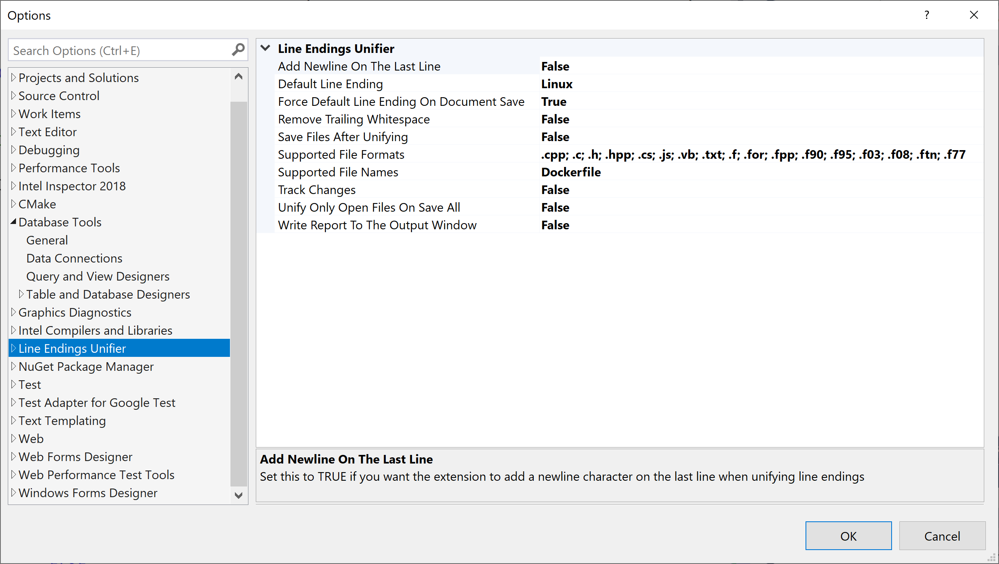
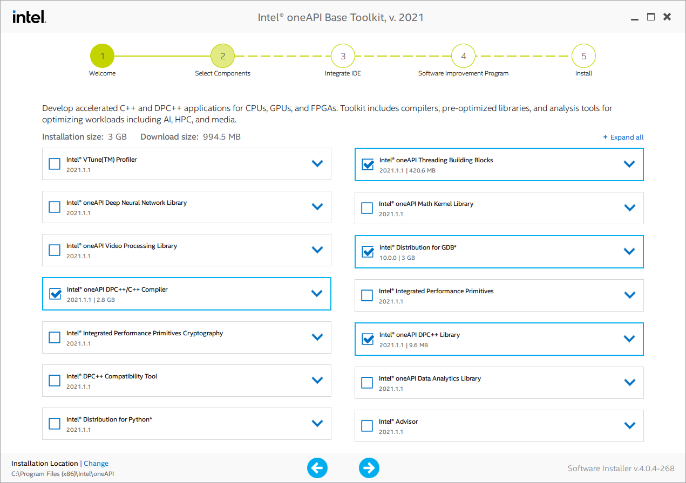
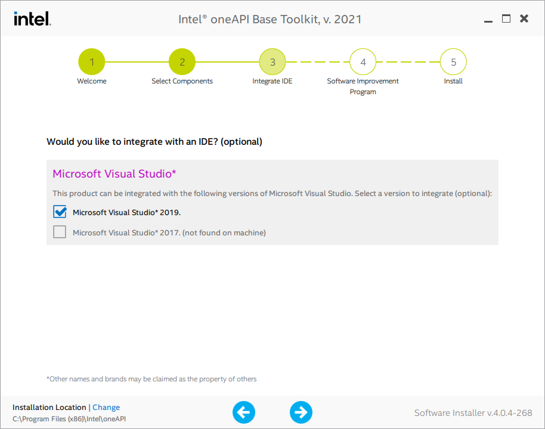
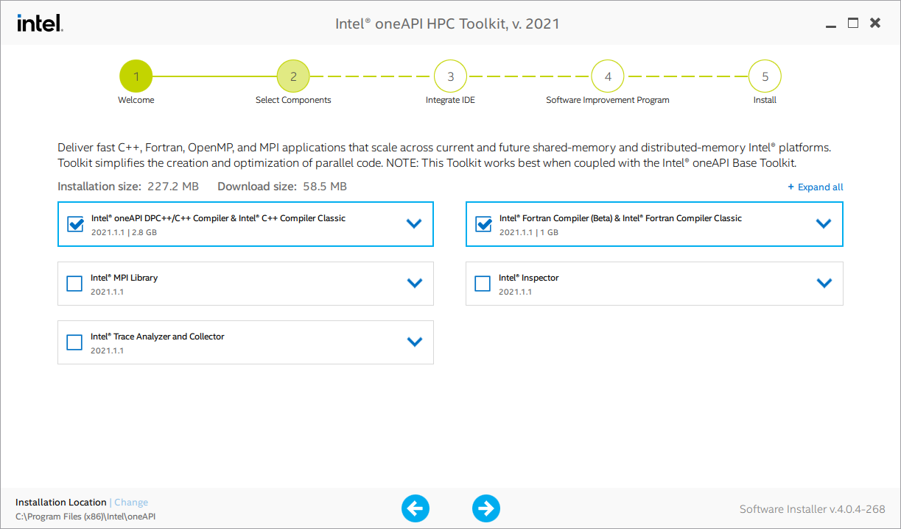

# Integrated Development Environment (IDE)

## Visual Studio 2019 Community Installation Guide (Windows 10)

Visual Studio (VS) does a major release every two years and distinguishes the major release with the year its released. The two recent versions are Visual Studio 2017 and Visual Studio 2019 (denoted as, vs2017 and vs2019). The key difference between the major versions is the Microsoft C compiler and .NET versions and not the version of Intel C and Fortran compilers. Each major release receives regular updates, but it is recommended to use the most recent major release for new installations of VS. 

The only caveat is that VS specific settings cannot be exported and imported between VS major versions. That is, you can not take vs2017, export its settings, then import them into vs2019. 

However, the VS *Project Solution* and *Project Files* should work for both vs2017 and vs2019.

### Visual Studio Input Files

The input to VS is composed of a *Project Solution* (`.sln`) and *Project Files* (eg `.vcxproj` and `.vfproj`). 

- The *Project Solution* file specify the location of the *project files*. 
- The *Project Files* contain a listing of the source files that are compiled in the project and compiler options.

VS uses the *Project Solution* file to open the *Project Files* to access the list of known source files for compilation.

### Visual Studio Editions

Visual Studio comes in three editions.

1. [Community](https://visualstudio.microsoft.com/vs/community)
2. [Professional](https://visualstudio.microsoft.com/vs/professional)
3. [Enterprise](https://visualstudio.microsoft.com/vs/enterprise)

The [Community](https://visualstudio.microsoft.com/vs/community) edition is **free** for students, open-source contributors, and individuals. 

The other two versions charge a fee and provide support options and easier file sharing and collaboration.

If you qualify for the community edition you can download the installation program at:

https://visualstudio.microsoft.com/thank-you-downloading-visual-studio/?sku=Community

### Install Visual Studio 2019

When you run the installation program there will be a set of updates run for the installer. 

The next window will ask you to install features of VS that you want to use. At a minimum, for using Intel Visual Fortran, you must include the `Desktop development with C++` option. 

See below for the location of that specific option. Next hit `Install` and wait for a very long time.

After installation, VS will ask if you want to log into your Microsoft account. You can skip this step and log in later if you do not want to log in. The advantage is that your settings are easier transferred across multiple computers (such as dark theme and window placement).

The next window will ask you for the theme. I just leave this as General and select the Dark theme.

The next window will ask you to start a project or download a git repository. 

At this time, just select `Continue without code`.

- You have successfully installed Visual Studio.
- Now close the Visual Studio window. 

## Visual Studio Recommended Plugin

For ease with git, it is best to keep all C and Fortran source files with Unix style endings (`LF`) instead of dos style (`CR LF`). 
Its a very minor semantic, but can make life easier when working with git or Linux/Unix machines.

To automatically use Unix style ending you can add the Visual Studio Extension [Line Endings Unifier](https://marketplace.visualstudio.com/items?itemName=JakubBielawa.LineEndingsUnifier). 

*Note that you may get a message saying "One or more extensions were loaded using deprecated API's", and you can click "Don't show this message for current extensions" to disable the warning. This warning occurs with the most recent update to Visual Studio and may be fixed by the plugin developer at some point. It does not seem to affect the plugin itself.*

- To install this extension you need to go to either
  - vs2017: The menu  `Tools` and select  `Extensions and Updates`. 
  - vs2019: The menu  `Extensions` and select  `Manage Extensions`. 
- Select the `Online` option on the upper left of the window and the type into the search bar `Line Endings Unifier`. 
- At that point you should see the following (Note that the figure circles in red the  `Online` option and the search bar). 
- Click `Download` to install the extension.

- Click download the extension, then close Visual Studio.
- Next the plugin will install and you must press `Modify` to continue.
- Now start back up Visual Studio and go to the menu `Tools` and select  `Options` to set up the Line Endings Unifier. 
  - The following the following settings will ensure that Unix style endings are enforced:

1. Set the `Default Line Ending` to **Linux**
2. Set the `Force Default Line Ending On Document Save` to **True**.
3. Set the `Supported File Formats` entry in the above window. 
   The following are the extensions that are in the image:
   `.cpp; .c; .h; .hpp; .cs; .js; .vb; .txt; .f; .for; .fpp; .f90; .f95; .f03; .f08; .ftn; .f77`

## Intel Visual Fortran - Intel OneAPI (Windows 10)

Intel Visual Fortran is now part of the [Intel OneAPI](https://software.intel.com/content/www/us/en/develop/tools/oneapi.html) software suite and is free to use. It requires that Visual Studio to be installed beforehand and two Intel specific installation files. The first is the [Intel oneAPI Base Toolkit](https://software.intel.com/content/www/us/en/develop/tools/oneapi/base-toolkit.html) and the second is [Intel oneAPI HPC Toolkit](https://software.intel.com/content/www/us/en/develop/tools/oneapi/hpc-toolkit.html). The later contains the Fortran compiler, which is dependent on the base toolkit.

1. Download the Intel oneAPI Base Toolkit by selecting the appropriate boxes at 
   https://software.intel.com/content/www/us/en/develop/tools/oneapi/base-toolkit/download.html 
2. Download the Intel oneAPI HPC Toolkit by selecting the appropriate boxes at 
   https://software.intel.com/content/www/us/en/develop/tools/oneapi/hpc-toolkit/download.html

------

The **Installer Type** option determines the download size. 

- The **Online** installer downloads a small file that downloads during installation the necessary files. 
- The **Local** indicates that the entire installer file is downloaded and can install without an internet connection.

------

### BASE Toolkit Installation - Intel oneAPI

1. Run either the online or local installation exe file downloaded and press continue. 
2. Check the tick box with *I accept the terms of the license agreement* (see the black circle below).
3. Click the *Customize* button (see the black box below).

The Intel oneAPI HPC Toolkit (Fortran Compiler) only requires the installation of the following components:

1. Intel Distribution for GDB
2. Intel oneAPI DPC++/C++ Compiler
3. Intel oneAPI DPC++ Library
4. Intel oneAPI Threading Building Blocks

The easiest way to do this is to uncheck all the boxes, note that the installer will complain about dependencies, and then click the four boxes that you need to install. 

Feel free to read about the other components and decide if you want to install them, but they are unnecessary to use the Fortran Compiler.

Once you have configured the correct components, the installation window should look something like this:

- Now hit the right arrow at the bottom of the window to continue. 
- Note you may get a warning about no Intel Graphics card, just ignore and continue.
- Next, oneAPI will detect if you have installed Visual Studio and offer integration if it is present. 
  If this box is not checked, then you will not be able to use Visual Studio with Intel Fortran to compile code.

- Next decide if you consent or do not consent to information being collected about you and hit next.
- Now get coffee or brew some tea, cause its going to take a while to install.
- Once the installation is done, close/exit the installer and restart your computer.

### HPC Toolkit Installation - Intel oneAPI

The HPC Toolkit can only be installed after the BASE toolkit. The first part of the installation is identical to the BASE installation.

1. Run either the online or local installation exe file downloaded and press continue. 
2. Check the tick box with *I accept the terms of the license agreement*.
3. Click the *Customize* button to continue.

The Intel oneAPI HPC Toolkit (Fortran Compiler) only requires the installation of the following components:

1. Intel oneAPI DPC++/C++ Compiler (note this was previously installed in the BASE Toolkit)
2. Intel Fortran Compiler & Intel Fortran Compiler Classic

The easiest way to do this is to uncheck all the boxes, note that the installer will complain about dependencies, and then click the four boxes that you need to install. 

Feel free to read about the other components and decide if you want to install them, but they are unnecessary to use the Fortran Compiler.

The are two Fortran compilers available 

1. Intel Fortran Compiler (Translates Fortran to the Multi-Level Intermediate Representation for the [LLVM Toolchain](https://llvm.org/)) 
2. Intel Fortran Compiler Classic (The compiler you will most likely use; formerly called Intel Parallel Studio)

Once you have configured the correct components, the installation window should look something like this:

- Now hit the right arrow at the bottom of the window to continue. 
- Next, oneAPI will detect if you have installed Visual Studio and offer integration if it is present. 
- If this box is not checked, then you will not be able to use Visual Studio with Intel Fortran to compile code.
- Next decide if you consent or do not consent to information being collected about you and hit next.

- Now get some more coffee or brew some stronger tea, cause its going to take a while to install.

**You now have installed visual studio with Intel Fortran.**

