# Integrated Development Environment (IDE)

This document provides an overview on how to setup the tools for compiling
[Batteries Included Fortran (BiF)](https://code.usgs.gov/fortran/bif).
In particular, the installation and setup of [MS Visual Studio](https://visualstudio.microsoft.com/) (the IDE) and [Intel oneAPI](https://www.intel.com/content/www/us/en/developer/tools/oneapi/overview.html) (Fortran and C compilers).
The tools mentioned are not endorsed in any way, but are used to build the
BiF library and run the test cases. 
Fortunately, as of writing this document, both Visual Studio and oneAPI offer free, no-cost editions. [GFortran](https://gcc.gnu.org/wiki/GFortran) and [LLVM Flang](https://flang.llvm.org/docs/) are open-source compilers that are available, but come with several limitations. First, there are multiple versions of GFortran, and most older versions are unable to compile this code due to compiler bugs or lack of newer fortran features (gfortran 11.3.0 and 12.1.0 can compile this repository). Second, GFortran tends to provide slower running executables compared to Intel Fortran. Despite this, the included makefile is set to compile with GFortran as the default option. Flang is a relatively new Fortran compiler that is part of the [LLVM](https://llvm.org/) project. While LLVM does support MS Windows, it is not considered "production ready".

This document will first explain what Visual Studio is, and how to do a minimal installation for setting up oneAPI. Then it will go over the minimal installation of oneAPI in order to compile
BiF.

[[_TOC_]]     

## Important Note: oneAPI Compiler Versions

Intel oneAPI currently has two Fortran compilers denoted as Intel Fortran Compiler Classic (**ifort**) and Intel Fortran Compiler (**ifx**). The ifort compiler, formerly called *Intel Parallel Studio* and *Intel Fortran Composer*, is the original Fortran compiler provided by Intel that is used to compile MODFLOW. The ifx compiler is a new, redesigned compiler by Intel that translates Fortran to a language-independent intermediate representation ([LLVM - Wikipedia](https://en.wikipedia.org/wiki/LLVM)) that is  compiled. The ifx compiler is intended to replace ifort and Intel has announced that support for ifort will only continue until December-2024. It is recommended to compile your code first with ifort, then try ifx and check to see if the solution deviates. If they do, then it is check if there is a solution at [Intel® Fortran Compiler - Intel Community](https://community.intel.com/t5/Intel-Fortran-Compiler/bd-p/fortran-compiler), if not then post your issue. 

To make compilers more confusing is the versioning of oneAPI is different for ifort and ifx. The oneAPI version is formatted as `YYYY.x`, where `YYYY` is the year released and `x` is a release number (bigger is newer). For example, the following are past versions from newest to oldest:

| oneAPI Version | ifx Version | ifort Version |
| -------------- | ----------- | ------------- |
| 2023.0         | 2023.0      | 2021.8        |
| 2022.3         | 2022.3      | 2021.7        |
| 2022.2         | 2022.2      | 2021.6        |
| 2022.1         | 2022.1      | 2021.5        |
| 2021.4         | 2021.4      | 2021.4        |

## Visual Studio Community Installation Guide (Windows 10)

Visual Studio (VS) does a major release every two to three years and distinguishes the version with the year it's released. The three recent versions are Visual Studio 2017, Visual Studio 2019, Visual Studio 2022  (denoted as, vs2017, vs2019, vs2022, respectively, and with sematic versioning as v15, v16, v17, respectively). The key difference between the "major" versions (vs2019, vs2022, vsXYZ) is the Microsoft  `.NET` framework and Microsoft `C` compilers included. This does not affect the Intel OneAPI, so long as the version of Visual Studio is supported by it. 

**It is important to ensure that both Fortran (ifort/ifx) and C (icc/icx) are supported by the Visual Studio version installed.** The C version is only necessary if you intend to compile the GMG solver. The C version is automatically installed along with the Intel oneAPI DPC++/C++ (which is a requirement of ifort). The Intel Compiler support in Visual Studio is specified at:  
https://www.intel.com/content/www/us/en/developer/articles/reference-implementation/intel-compilers-compatibility-with-microsoft-visual-studio-and-xcode.html  
Make sure to pay attention to the VS sematic versions that are supported. It should be noted that ifort only supports older versions of VS2022, as shown below, so **it is recommended to use VS2019**.

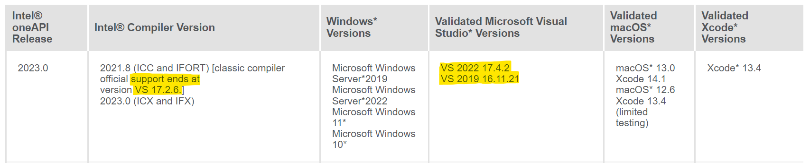

### Visual Studio Input Files

The input to VS is composed of a *Project Solution* (`.sln`) and *Project Files* (eg `.vcxproj` and `.vfproj`). 

- The *Project Solution* file specifies the location of the *Project Files*. 
- The *Project Files* contain a listing of the source files that are compiled in the project and compiler options.

VS uses the *Project Solution* file to open the *Project Files* to access the list of known source files for compilation.

### Visual Studio Editions

Visual Studio comes in three editions.

1. [Community](https://visualstudio.microsoft.com/vs/community)
2. [Professional](https://visualstudio.microsoft.com/vs/professional)
3. [Enterprise](https://visualstudio.microsoft.com/vs/enterprise)

The [Community](https://visualstudio.microsoft.com/vs/community) edition is **free** for students, open-source contributors, and individuals. 

The other two versions charge a fee and provide support options and easier file sharing and collaboration.

If you qualify for the community edition you can download the latest edition installation program at:

https://visualstudio.microsoft.com/thank-you-downloading-visual-studio/?sku=Community

&nbsp; &nbsp; &nbsp; ➥ [Make sure Intel oneAPI supports it](https://www.intel.com/content/www/us/en/developer/articles/reference-implementation/intel-compilers-compatibility-with-microsoft-visual-studio-and-xcode.html)

&nbsp; &nbsp; &nbsp; ➥  You can download a specific older version at:  
&nbsp; &nbsp; &nbsp; &nbsp; &nbsp; &nbsp; https://visualstudio.microsoft.com/vs/older-downloads/  
&nbsp; &nbsp; &nbsp; &nbsp; &nbsp; &nbsp;  &nbsp; &nbsp; &nbsp; ➥  Use this link to download VS2019.

### Install Visual Studio

When you run the installation program there will be a set of updates run for the installer.  
(Note, the following images are screenshots while installing Visual Studio 2019.)

The next window will ask you to install the features of VS that you want to use.  
At a minimum, for using Intel Visual Fortran (ifort), you must include the `Desktop development with C++` option.   
 &nbsp; &nbsp; ➥ See below for the location of that specific option. Press `Install` to continue with installation.

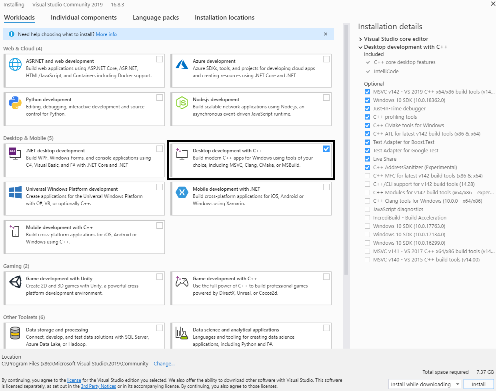

After installation, VS will ask if you want to log into your Microsoft account. You can skip this step and log in later if you do not want to log in. The advantage to logging in to your Microsoft account is that your settings are transferred across multiple computers (such as dark theme and window placement).

The next window will ask you to select a theme. You may want to leave this as *General* and select the *Dark* theme. Note that, this window may not appear if you signed into your Microsoft account.

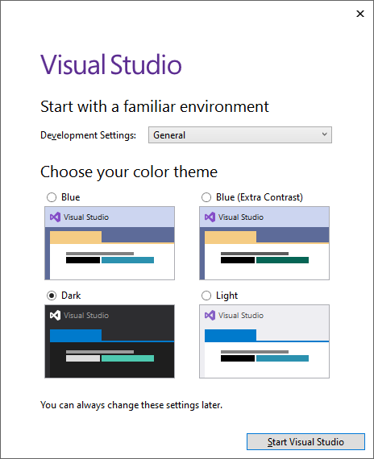

 &nbsp; &nbsp; ➥ The next window will ask you to start a project or download a git repository. 

 &nbsp; &nbsp; ➥ At this time, just select `Continue without code`.

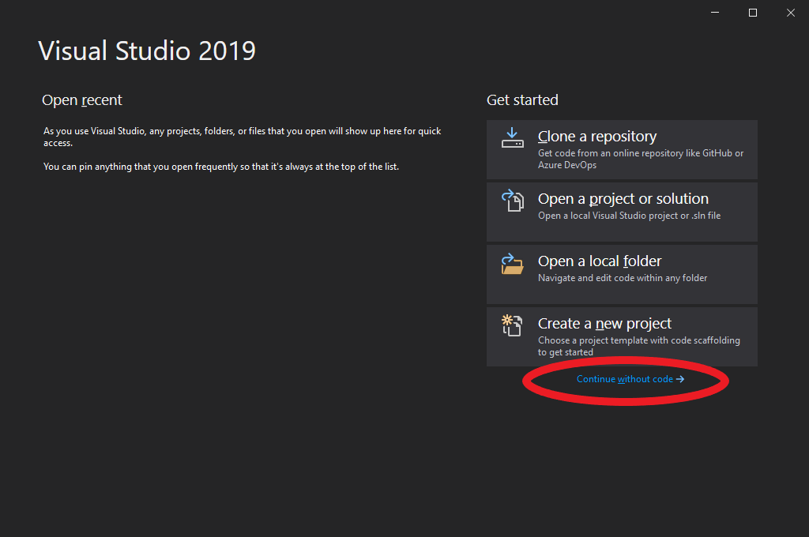

&nbsp; 

&nbsp; &nbsp; &nbsp; ➥ You have successfully installed Visual Studio.

&nbsp; &nbsp; &nbsp; ➥ Now close the Visual Studio window. 

&nbsp; 

Visual Studio does not yet understand Fortran syntax nor can it read a solution/project files created for Intel Fortran 
(such as, `bif.vfproj`). 
If you attempt to open an Intel oneAPI solution or project file, then you will get the following error message:

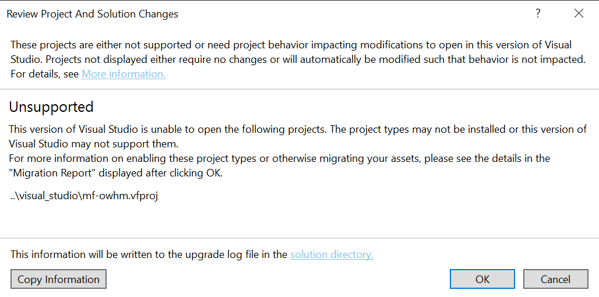

In the event of this error, just hit cancel, close Visual Studio and install the Intel oneAPI as described in the [Intel oneAPI and Visual Fortran](#intel-oneapi-and-visual-fortran) section. If you already have the most current version of Intel oneAPI installed and do not want to go through the entire install process, then you selectively add support through the `Modify` menu and selection `Add/Remove components` option. However, it is recommended to uninstall oneAPI and reinstall it as described in the [Fixing Visual Studio Installed After Intel OneAPI](#fixing-visual-studio-installed-after-intel-oneapi) section.

## Visual Studio Optional Plugin

For ease with using git, it is best to keep all C and Fortran source files with Unix style endings (`LF`) instead of dos style (`CR LF`). 
This minor semantic can make working with git or Linux/Unix machines easier.

To automatically use Unix style ending you can add the Visual Studio Extension [Line Endings Unifier](https://marketplace.visualstudio.com/items?itemName=JakubBielawa.LineEndingsUnifier). 

*Note that you may get a message saying "One or more extensions were loaded using deprecated API's", and you can click "Don't show this message for current extensions" to disable the warning. This warning occurs with the most recent update to Visual Studio and may be fixed by the plugin developer in the future. It does not seem to affect the plugin itself.*

- To install this extension go to either:
  - vs2017: The menu  `Tools` and select  `Extensions and Updates`. 
  - vs2019: The menu  `Extensions` and select  `Manage Extensions`. 
- Select the `Online` option on the upper left of the window and the type into the search bar `Line Endings Unifier`. 
- At that point you should see the following (Note the figure below that shows the Online option and the search bar circled in red). 
- Click `Download` to install the extension.

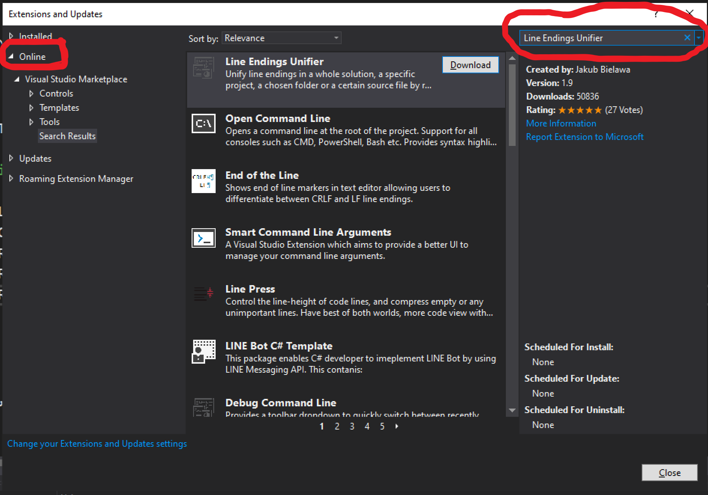

- Close Visual Studio.
- Next, the plugin will install and you must press `Modify` to continue.
- Open Visual Studio and go to the menu `Tools` and select  `Options` to set up the Line Endings Unifier. 
  - The following the following settings will ensure that Unix style endings are enforced:

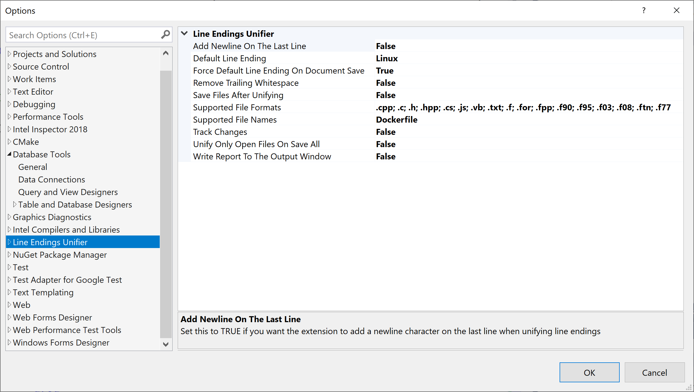

1. Set the `Default Line Ending` to **Linux**
2. Set the `Force Default Line Ending On Document Save` to **True**.
3. Set the `Supported File Formats` entry in the above window. 
   The following are the extensions that are in the image:
   `.cpp; .c; .h; .hpp; .cs; .js; .vb; .txt; .f; .for; .fpp; .f90; .f95; .f03; .f08; .ftn; .f77`

## Intel oneAPI and Visual Fortran

Intel Visual Fortran is now part of the [Intel OneAPI](https://software.intel.com/content/www/us/en/develop/tools/oneapi.html) software suite and is free to use. It requires that Visual Studio be installed beforehand plus two Intel specific installation files: the [Intel oneAPI Base Toolkit](https://software.intel.com/content/www/us/en/develop/tools/oneapi/base-toolkit.html) and the [Intel oneAPI HPC Toolkit](https://software.intel.com/content/www/us/en/develop/tools/oneapi/hpc-toolkit.html). The latter contains the Fortran compiler, which is dependent on the base toolkit.

1. Download the Intel oneAPI Base Toolkit by selecting the appropriate boxes at:  
   https://www.intel.com/content/www/us/en/developer/tools/oneapi/base-toolkit-download.html 
2. Download the Intel oneAPI HPC Toolkit by selecting the appropriate boxes at:  
   https://software.intel.com/content/www/us/en/develop/tools/oneapi/hpc-toolkit/download.html

------

The **Installer Type** option determines the download size. 

- The **Online** installer downloads a small installation file that lets the user configure the total download (requires internet during installation). 
- The **Local** installer downloads all features into a single installation file (no internet required by the installer). This version should be used if the Online installer keeps failing to install the files.

------

### BASE Toolkit Installation - Intel oneAPI

- Run either the online or local installation exe file downloaded and press continue. 
- Check the tick box with *I accept the terms of the license agreement* (see the black circle below).
- If you do not care about the size of the installation, click *Continue* for the Recommended Installation.  
  Otherwise, click the *Customize* button (see the black box below) and the following will show the minimal required installation.

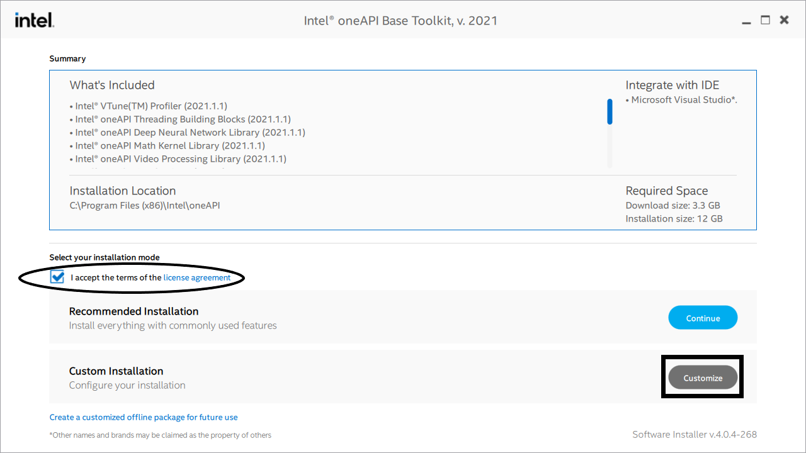

- The Intel oneAPI HPC Toolkit (Fortran Compiler) only requires the installation of the following components:
  1. Intel Distribution for GDB
  2. Intel oneAPI DPC++/C++ Compiler
  3. Intel oneAPI DPC++ Library
  4. Intel oneAPI Threading Building Blocks

The easiest way to do this is to uncheck all the boxes, note that the installer will complain about dependencies, and then click the four boxes that you need to install. 

Feel free to read about the other components and decide if you want to install them, but they are unnecessary to use the Fortran Compiler.

- Once you have configured the correct components, the installation window should look something like this:

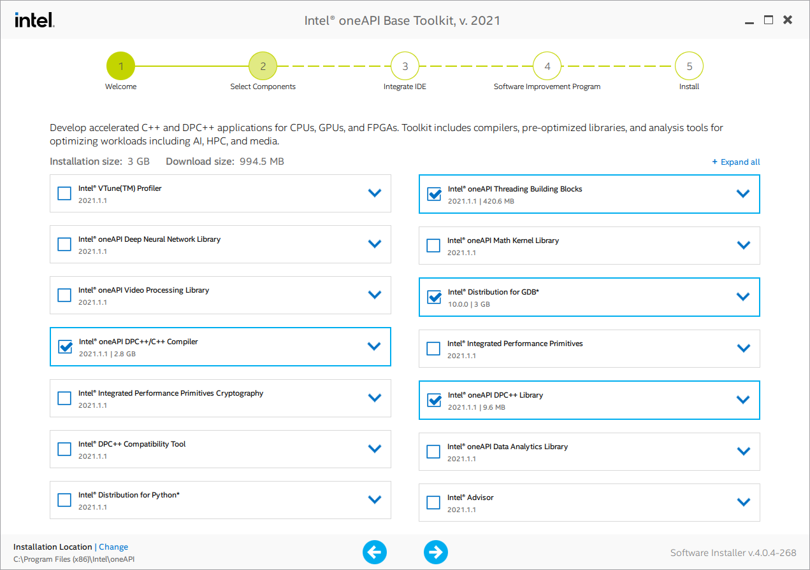

- Now hit the right arrow at the bottom of the window to continue. 
- Note you may get a warning about no Intel Graphics card, just ignore and continue.
- Next, oneAPI will detect if you have installed Visual Studio and offer integration if it is present. 
  If this box is not checked, then you will not be able to use Visual Studio with Intel Fortran to compile code.

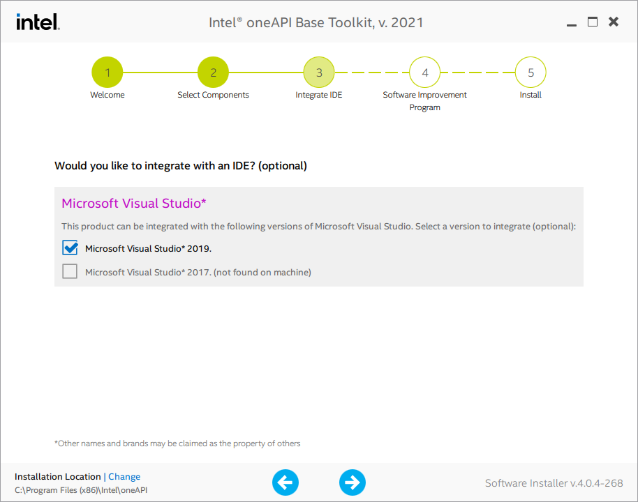

- Select you consent or do not consent to information being collected about you and hit next.
- Now get coffee or brew some tea, cause its going to take a while to install.
- Once the installation is done, close/exit the installer and restart your computer.

### HPC Toolkit Installation - Intel oneAPI

The HPC Toolkit can only be installed after the BASE toolkit. The first part of the installation is identical to the BASE installation.

- Run either the online or local installation exe file downloaded and press continue. 
- Check the tick box with *I accept the terms of the license agreement*.
- Click the *Customize* button to continue or select *Continue* for the Recommended Installation if you don't care about storage space.

- The Intel oneAPI HPC Toolkit (Fortran Compiler) only requires the installation of the following components:
  1. Intel oneAPI DPC++/C++ Compiler  
     (note this was previously installed in the BASE Toolkit, but you need it checked or it will uninstall it)
  2. Intel Fortran Compiler & Intel Fortran Compiler Classic

The easiest way to do this is to uncheck all the boxes, note that the installer will complain about dependencies, and then click the four boxes that you need to install. 

Feel free to read about the other components and decide if you want to install them, but they are unnecessary to use the Fortran Compiler. If you skipped the section [Import Note: oneAPI Compiler Versions](#import-note:-oneapi-compiler-versions), please review that about the difference between Intel Fortran Compiler (ifx) and the Intel Fortran Compiler Classic (ifort).

- Once you have configured the correct components, the installation window should look something like this:

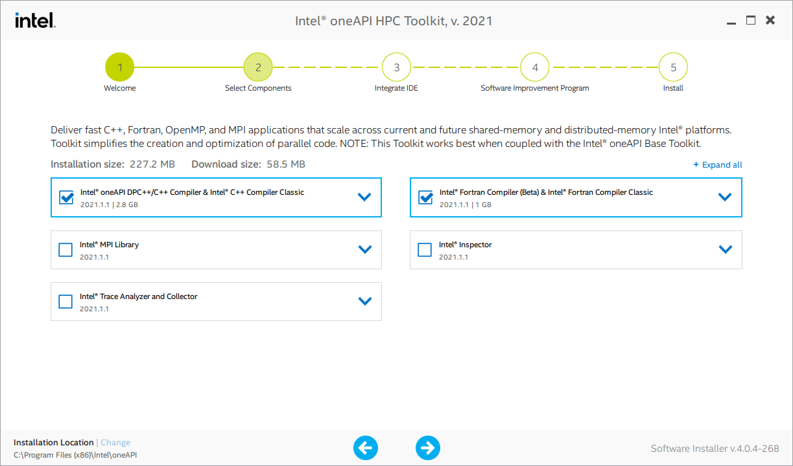

- Now hit the right arrow at the bottom of the window to continue. 
- Next, oneAPI will detect if you have installed Visual Studio and offer integration if it is present. 
- If this box is not checked, then you will not be able to use Visual Studio with Intel Fortran to compile code.
- Next decide if you consent or do not consent to information being collected about you and hit next.

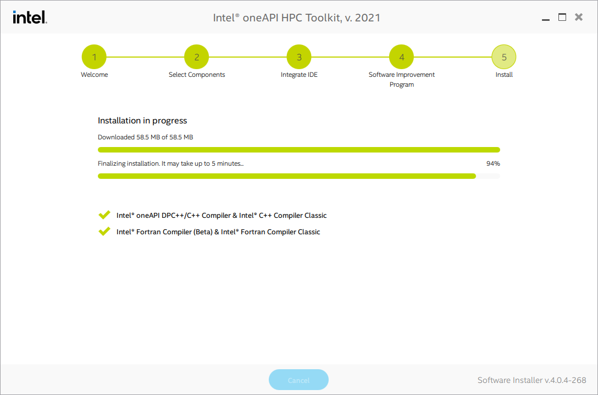

- Now get some more coffee or brew some stronger tea, cause its going to take a while to install.

**You now have installed Visual Studio with Intel Fortran.**

## Opening BiF with Visual Studio for Compilation

This section briefly discusses how to open in Visual Studio the BiF *Project Solution* (`.sln`) files and start the Intel Fortran compiler to build an executable (`exe`). 

The input files for compilating BiF, called a *Project Solution* (`.sln`) and *Project Files* (eg `.vcxproj` and `.vfproj`), are located in`ide/visual_studio`. 

At a minimum you should see:

- `bif.vfproj`
- `BiF_Project.sln`

and any additional files are created by Visual Studio for any local customizations, such as breakpoints and IDE window arrangement. 

The first time you run `BiF_Project.sln` you will have to associate it with what program to run it with. I recommend picking a single version of Visual Studio rather than the "Selector". You can always change the version with the Windows "Open With" right click option:

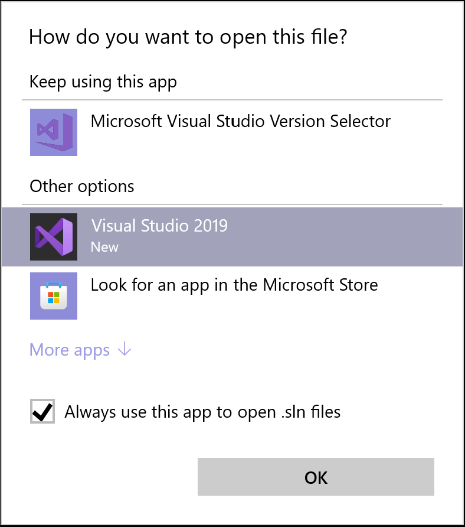

Before you can compile you need to select the Configuration and Platform. The Platform should always be set to x64 for a 64bit Windows and the the project includes the following configurations:

- Release  
   &nbsp; ➣ `-O2` Maximize Speed optimization with source line numbers embedded  
   &nbsp; ➣ Builds `bif.exe`
- Debug  
   &nbsp; ➣ Debug model with all compilation and runtime checks (very slow)  
   &nbsp; ➣ Builds `bif_debug.exe`
- Fast_Debug  
   &nbsp; ➣ Debug model with only important compilation and runtime checks (slow)  
   &nbsp; ➣ Builds `bif_fast_debug.exe`

To compile a new executable, go to the `Build` menu and select `Build Solution` or `Rebuild Solution`. The only difference between the two, is that Rebuild will delete all existing intermediate files before compilation (this forces all new files to be generated).

## Fixing Visual Studio Installed After Intel oneAPI

If Visual Studio is installed after oneAPI, then it will not recognize Fortran syntax nor load oneAPI *Project Files* (eg `.vcxproj` and `.vfproj`). There is limited success of dealing with installing Visual Studio after installing Intel OneAPI, so **its recommend to just uninstall everything and start reinstalling Visual Studio, followed by oneAPI**. It also is recommended to restart before installing the first program, and after each program's installation completes. This ensures that there are no locked files that can corrupt the installation process.

